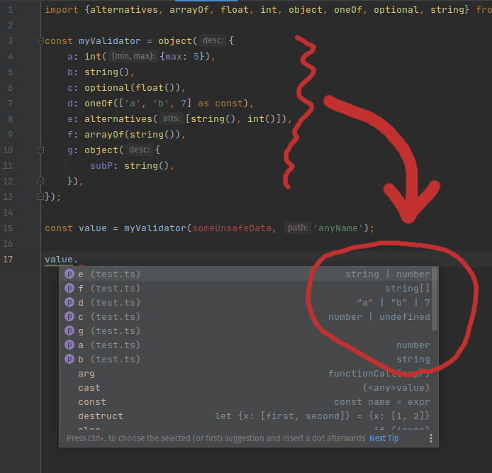

# checkeasy


Light, expressive and type-safe data validation in typescript.



As you can see, you DON'T NEED to write your schema twice (for validation and for typescript).
Just use validator functions, which return well typed results. So typescript is acknowledged about shape of your data and checks its usages on compilation stage.

# Why I need one more type validator?

Because I wanted to have type validation which:

- Super light and easy

  Library is small. No core with tons of unnecessary functionality.
  Each validator is exported separately. So if you use tree shaking in your project, only validators used by you 
  will be in your bundle.

- Written with typescript in mind
    
  It always returns typed results

- Support of transformations

  E.g. I can convert strings to numbers on the fly, if I want to do so

- Easy extensible with custom validators

  Validator is a function. Adding new one is as simple, as writing new function.

# Documentation

- [Validators](#validators)
    - [int](#int)
    - [strToInt](#strtoint)
    - [float](#float)
    - [strToFloat](#strtofloat)
    - [string](#string)
    - [boolean](#boolean)
    - [strToBoolean](#strtoboolean)
    - [object](#object)
    - [arrayOf](#arrayof)
    - [exact](#exact)
    - [oneOf](#oneof)
    - [alternatives](#alternatives)
    - [optional](#optional)
    - [nullable](#nullable)
    - [defaultValue](#defaultvalue)
    - [uuid](#uuid)
    - [email](#email)
    - [any](#any)
    - [transform](#transform)
- [Custom validators](#custom-validators)
 
# Validators


Although, it's really easy to create your own validators, library exports few ready to go ones.

## int

Checks if value is an integer.

Possible options:

- min
- max

```ts
const validator1 = int() 
validator1(5, 'myValue'); // returns: 5 

const validator2 = int() // returns: 5
validator2('5', 'myValue'); // throws: [myValue] should be an integer

const validator3 = int({min: 0, max: 4});
validator3(5, 'myValue'); // throws: [myValue] is larger than the allowed maximum (4)
```

## strToInt

The same as [int](#int) but also tries to convert string to integer, if value is string.

It's convenient for validating/parsing url params, which initially are strings.

## float
Checks if value is a finite number.

Possible options:

- min
- max

```ts
const validator1 = float() 
validator1(5.2, 'myValue'); // returns: 5 

const validator2 = float();
validator2('5.2', 'myValue'); // throws: [myValue] should be a float

const validator3 = float({min: 0, max: 4});
validator3(5.2, 'myValue'); // throws: [myValue] is larger than the allowed maximum (4)
```

## strToFloat

The same as [float](#float) but also tries to convert string to float, if value is string.

It's convenient for validating/parsing url params, which initially are strings.

## string

Checks if value is a string.

Possible options:

- min - min length of string
- max - max length of string
- pattern - regex to test with

```ts
const validator1 = string()
validator1('aaa', 'myValue'); // returns: "aaa"

const validator2 = string()
validator2({}, 'myValue'); // throws: [myValue] should be a string

const validator3 = string({max: 3});
validator3('aaaa', 'myValue'); // throws: [length(myValue)] is larger than the allowed maximum (4)

const validator4 = string({patten: /^[a-z]{3}$/i});
validator4('aaaa', 'myValue'); // throws: [myValue] doesn't match the pattern
```

## boolean

Checks if value is a boolean.

```ts
const validator1 = boolean()
validator1(true, 'myValue'); // returns: true

const validator2 = boolean()
validator2('true', 'myValue'); // throws: [myValue] should be a boolean
```

## strToBoolean

The same as [boolean](#boolean) but also converts strings ("1", "true", "yes") to true, and ("0", "false", "no") to false.

It's convenient for validating/parsing url params, which initially are strings. 

## object

Check if a value is an object and runs validation on all of its properties by given shape.

Receives 1 or 2 parameters.

First one should be an object. Values of this object should be validators, which will be called to check properties.

```ts
const validator = object({
    a: int(),
    b: optional(string({max: 3})),
    c: v => v,
});

validator({a: 5, c: 'anystring'}, 'myValue'); // returns: {a: 5, b: undefined, c: 'anystring'}

validator({a: 5, b: 25, c: 'anystring'}, 'myValue'); // throws: [myValue.b] should be a string

validator('something totally different', 'myValue'); // throws: [myValue] should be an object
```

There are additional options can be passed with second param:

- ignoreUnknown - ignore properties which are not described in first param (by default: false)
- min - min amount of object properties
- max - max amount of object properties

```ts
const validator = object({
    a: int(),
    b: optional(string({max: 3})),
    c: v => v,
}, {
  ignoreUnknown: true,
  min: 2,
  max: 3,
});
```

## arrayOf

Checks if value is an array and checks each of its elements with given validator.

You can also pass options in second parameter:

- min - min length of array
- max - max length of array

```ts
const validator1 = arrayOf(string());
validator1(['1', '2', '3'], 'myValue').toEqual(['1', '2', '3']); // returns: ['1', '2', '3']

const validator2 = arrayOf(int());
validator2({a: 2}, 'myValue'); // throws: [myValue] should be an array

const validator3 = arrayOf(int());
validator3([1, 2, '3'], 'myValue'); // throws: [myValue[3]] should be an integer

const validator4 = arrayOf(int(), {max: 2});
validator4([1, 2, 3, 'abc'], 'myValue'); // throws: [length(myValue)] is larger than the allowed maximum (2)

const validator5 = arrayOf(
    object({
        a: string(),
    }),
);
validator5([{a: 'aa'}], 'myValue'); // returns: [{a: 'aa'}]
validator5([{a: 2}], 'myValue'); // throws: [myValue[0].a] should be a string
```

## exact

Checks if value strictly equals one of the given values.

```ts
const validator1 = exact(1);
validator1(1, 'myValue'); // returns: 1

const validator2 = exact(1)
validator2('1', 'myValue'); // throws: [myValue] isn't equal to the expected value

const validator3 = exact({a: 1});
validator3({a: 1}, 'myValue'); // throws: [myValue] isn't equal to the expected value
    // it's because it doesn't call deepEqual, but uses with strict equality
```

## oneOf

Checks if value strictly equals one of the given values.

```ts
const validator1 = oneOf([1, 2, '3'] as const);
validator1('3', 'myValue'); // returns: 3

const validator2 = oneOf([1, 2, '3'] as const)
validator2(3, 'myValue'); // throws: [myValue] isn't equal to any of the expected values

const validator3 = oneOf([1, 2, {a: 1}] as const);
validator3({a: 1}, 'myValue'); // throws: [myValue] isn't equal to any of the expected values
// it's because it doesn't call deepEqual, but uses with strict equality
```

___If you want typescript to make a type with exactly your values, add "as const" after array, to let typescript know -
your array is readonly:___

```ts
const validator1 = oneOf([1, 2, '3'] as const);
const value1 = validator1(1, 'myValue');
// here type of value1 = 1 | 2 | "3"

const validator2 = oneOf([1, 2, '3']);
const value2 = validator1(1, 'myValue');
// but here type of value2 = number | string
// as typescript recognizes type of your values array as Array<string | number> in this case
```

## alternatives

Checks a value with the help of every of passed validators, one by one. Returns value from first validator, which doesn't fail.

If all validators failed, throws an error.

```ts
const validator = alternatives([
    string(),
    object({
        a: string(),
    }),
]);
validator({a: '5'}, 'myValue'); // returns: {a: '5'}

validator({a: 5}, 'myValue');
//  throws: [myValue] doesn't match any of allowed alternatives:
//    0: [*] should be a string
//    1: [*.a] should be a string
```

## optional

Add undefined as a possible value to given validator. Although, it can be used itself, it's very helpful for optional values in objects.

```ts
const validator = object({
    a: optional(string()),
});
validator({}, 'myValue'); // returns: {a: undefined}
validator({a: '123'}, 'myValue'); // returns {a: '123'}
validator({a: 456}, 'myValue'); // throws: [myValue.a] should be a string
validator({a: null}, 'myValue'); // throws: [myValue.a] should be a string
  // (null is not the same as undefined)
```

> Don't forget to enable typescript strictNullChecks config, if you want typescript to check null and undefined in resulting types.

## nullable

Similar to optional. But instead of _undefined_, it allows value be null.

> Don't forget to enable typescript strictNullChecks config, if you want typescript to check null and undefined in resulting types.

If you want to have optional and nullable value (so null and undefined will be allowed), you can make a composition of `optional(nullable(...))`.

## defaultValue

If value is undefined, returns some default value passed as first parameter.

Otherwise, runs validator given in second parameter.

```ts
const validator = object({
    a: defaultValue('123', string()),
});
validator({}, 'myValue'); // returns: {a: '123'}
validator({a: 'uuu'}, 'myValue'); // retunrs: {a: 'uuu'}
validator({a: ''}, 'myValue'); // returns: {a: ''}
validator({a: null}, 'myValue'); // throws: [myValue.a] should be a string
```

## uuid

Checks if value is a valid uuid string.

## email

Checks if value is a valid email string.

## any

There isn't _"any"_ type, but you can easily emulate it using `v => v`.

```
const validator = object({
    stringProp: strint(),
    anyProp: v => v,
});
```

## transform

Sometimes you may want to transform value after some validation and pass it to next validator.

```ts
// Let's imagine we want to validate some id, which can be represented by string like "user:1" or by object
// like {type: 'user', id: '1'}
// we can make one validator for that, which returns a string for both cases

const validator = alternatives([
    string({pattern: /^[a-z0-9]+\:[a-z0-9]+$/}),
    transform(
        object({
            id: string({min: 1}),
            type: string({min: 1}),
        }),
        obj => `${obj.type}:${obj.id}`,
    ),
]);

validator('user:1', 'myValue'); // returns: "user:1"
validator({type: 'user', id: '1'}, 'myValue'); // returns "user:1"
validator({type: 'user'}, 'myValue');
//    throws: [myValue] doesn't match any of allowed alternatives:
//      0: [*] should be a string
//      1: [*.id] should be a string
validator('asd', 'myValue');
//    throws: [myValue] doesn't match any of allowed alternatives:
//      0: [*] doesn't match the pattern
//      1: [*] should be an object

``` 

Error handling
--------------

In the case of validation failed, validator throws instance of ValidationError. So, it's easy to catch it.

```ts
import {ValidationError, int} from './index';

const validator = int();

try {
    
    validator('a', 'myValue');
    
} catch (err) {
      
    if (err instanceof ValidationError) {
        //...  
    }
  
    // OR
  
    if (err.name === 'ValidationError') {
        //...  
    }
    
}
```

# Custom validators

The idea here is simple. To check any type of value you should to create a validator.

__Validator is a function__ which receives 2 parameters: _value_ to validate and a _path_.

```ts
type Validator<T> = (v: any, path: string) => T;
```

In case of validation error, validator should throw a ValidationError,
using _path_ to point at a place of shape, where validation failed.

In case of success validator should return a value.
Validator can return the same value which was received.
Or some another value, if it should be modified on the fly.

You can make inline validators. E.g.:

```ts
const myValidator = object({
  id: string(),
  type: (v, path): string => {
      if (typeof v !== 'string' || !v.startsWith('TYPE__')) {
          throw new ValidationError(`[${path}] is not correct type`);
      }
      return v;
  }
});
```

If you want to crate reusable validator, the convention is to wrap it into one more function, which can additionally
receive options as parameters. E.g. _int_ validator can look like:

```ts
export const int = ({min, max}: {min?: number; max?: number} = {}): Validator<number> => (v, path) => {
    if (!Number.isInteger(v)) {
        throw new ValidationError(`[${path}] should be an integer`);
    }
    if ((min !== undefined && v < min) || (max !== undefined && v > max)) {
        throw new ValidationError(`[${path}] isn\'t in allowed range`);
    }
    return v;
};
```

Let's create one more validator, which checks, does value exactly match given example:

```ts
const exactMatch = <T>(exactValue: T): Validator<T> => (v, path) => {
    if (v !== exactValue) {
        throw new Error(`[${path}] isn't the same as allowed value`);
    }
    return v;
};
```

We can use it itself:

```ts
// let's check value 
const validator = exactMatch(5);
validator(10, 'myValue'); // throws: [myValue] isn't the same as allowed value
```

... or let's combine it with other validators

```ts
import {object, optional} from 'checkeasy';
const validator = object({
    a: exactMatch(5),
    b: optional(exactMatch(7)),
    c: exactMatch(10),
});
validator({a: 5, c: 10}, 'myValue'); // returns: { a: 5, b: undefined, c: 10 }
validator({a: 5, c: 12}, 'myValue'); // throws: [myValue.c] isn't the same as allowed value
```

# Changelog

## [1.1.0] - 2022-05-20

- Added ValidationError, improved error messages.
- Changed some error messages
- Changes in README

Thank you [joshuafcole](https://github.com/joshuafcole) for some changes here

## [1.2.0] - 2024-08-02

- Fixed regular expression for email and uuid checks

# License

ISC

Copyright 2021 Roman Ditchuk

Permission to use, copy, modify, and/or distribute this software for any purpose with or without fee is hereby granted, provided that the above copyright notice and this permission notice appear in all copies.

THE SOFTWARE IS PROVIDED "AS IS" AND THE AUTHOR DISCLAIMS ALL WARRANTIES WITH REGARD TO THIS SOFTWARE INCLUDING ALL IMPLIED WARRANTIES OF MERCHANTABILITY AND FITNESS. IN NO EVENT SHALL THE AUTHOR BE LIABLE FOR ANY SPECIAL, DIRECT, INDIRECT, OR CONSEQUENTIAL DAMAGES OR ANY DAMAGES WHATSOEVER RESULTING FROM LOSS OF USE, DATA OR PROFITS, WHETHER IN AN ACTION OF CONTRACT, NEGLIGENCE OR OTHER TORTIOUS ACTION, ARISING OUT OF OR IN CONNECTION WITH THE USE OR PERFORMANCE OF THIS SOFTWARE.
